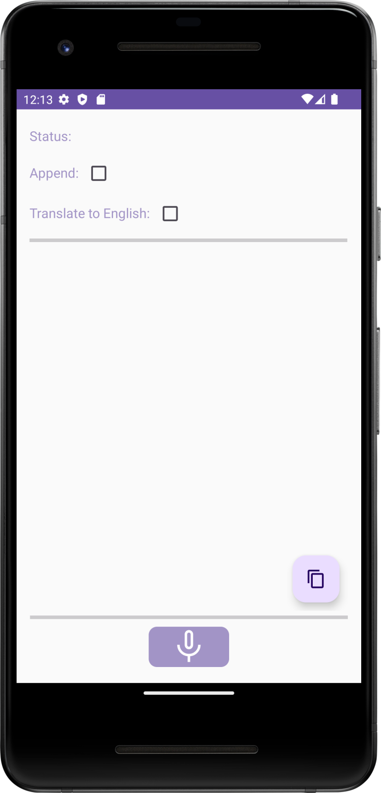
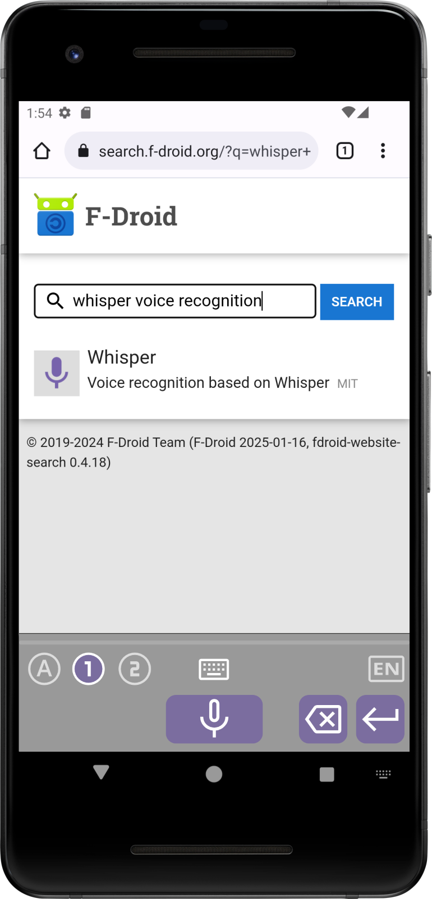
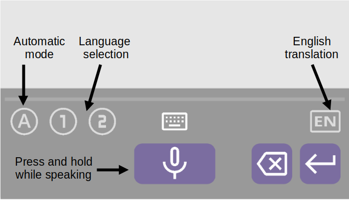

# VoxIME

Offline-Spracherkennung für Android, basierend auf der **Voxtral**-Architektur ([Voxtral-Mini-3B-2507](https://huggingface.co/mistralai/Voxtral-Mini-3B-2507), Apache-2.0) — vollständig lokal, kein Cloud-Dienst, keine Telemetrie.

VoxIME ist ein Fork von [Whisper+](https://github.com/woheller69/whisperIMEplus) (GPLv3, © woheller69), dessen Whisper-Engine durch eine Voxtral-ONNX-Engine ersetzt wurde.

  

## Funktionen

- **Eingabemethode (IME):** Diktieren in jede App, z. B. über die Mikrofon-Taste in [HeliBoard](https://github.com/hellobibo/HeliBoard)
- **Systemweiter Spracheingabe-Dienst** (RecognitionService) — in Android unter *System > Sprachen > Spracheingabe* aktivierbar
- **Standalone-App** für einzelne Diktate (max. 30 s pro Aufnahme)
- **Sprachen:** en, de, fr, es, it, pt, nl, hi (plus automatische Erkennung)
- **Komplett offline** nach einmaligem Modell-Download

## Ersteinrichtung

Beim ersten Start der App:

1. **„Download Voxtral model (~2.7 GB)"** antippen — die App lädt die ONNX-Modelldateien direkt von [Hugging Face](https://huggingface.co/onnx-community/Voxtral-Mini-3B-2507-ONNX) herunter (mit Fortschrittsanzeige; bei Abbruch wird der Download beim nächsten Versuch fortgesetzt). Alternativ kann ein Modell-Zip manuell installiert werden.
2. Danach Sprachen in den Einstellungen festlegen und loslegen.

**Hinweise:**
- Das Modell benötigt ~2,7 GB Speicher und beim Diktieren ~3 GB freien RAM. Geräte mit 6 GB RAM werden empfohlen.
- Die Erkennung eines kurzen Diktats (5–15 s Audio) dauert je nach Gerät einige Sekunden.
- Für die Nutzung als Spracheingabe-Dienst (nicht IME): App in *System > Sprachen > Spracheingabe* aktivieren. Falls die App dort nicht erscheint:
  - USB-Debugging aktivieren
  - `adb shell settings put secure voice_recognition_service org.voxime/com.whisperonnx.WhisperRecognitionService`

## Fehlerdiagnose: Log teilen

Die App schreibt alle Engine-, Download- und Fehlermeldungen in `voxime.log` (im App-Datenordner). Im Hauptmenü (drei Punkte) gibt es **„Log kopieren"** (direkt in die Zwischenablage) und **„Log teilen"** (Datei per E-Mail/Messenger). Bei Problemen hilft sie extrem bei der Ferndiagnose.

## Tipps für gute Ergebnisse

- Sprechertaste gedrückt halten (oder automatischen Modus verwenden)
- Kurz pausieren, bevor du sprichst
- Klar und in moderatem Tempo sprechen
- Max. 30 s pro Aufnahme — für Längeres Taste loslassen und erneut drücken; weiteres Sprechen während der Erkennung ist möglich

## Architektur

Die komplette Inferenz läuft über [ONNX Runtime](https://onnxruntime.ai/) (MIT):

1. **Mel-Spektrogramm** (128 × 3000, exakte Whisper-Vorverarbeitung, Slaney-Mel-Skala)
2. **Audio-Encoder** (`audio_encoder_q4f16.onnx`) → 375 × 3072 Audio-Embeddings
3. **Prompt:** `<s>[INST][BEGIN_AUDIO][AUDIO]×375 lang:<iso> [TRANSCRIBE][/INST]` — Token-Embeddings via `embed_tokens_q4.onnx`, Audio-Positionen werden mit den Encoder-Ausgaben überschrieben
4. **Decoder-Loop** (`decoder_model_merged_q4.onnx`) mit KV-Cache, greedy bis EOS

Der Tokenizer ist byte-level BPE (Tekken); das Vokabular (`tokenizer.json`) liegt als Asset in der App, die Prompt-Token-IDs sind für alle Sprachen vorberechnet.

## Download

Signierte APK im Branch `vibe/finish-voxtral-apk` unter [`apks/VoxIME-0.4.1.apk`](https://github.com/cirstoph/VoxIME/raw/vibe/finish-voxtral-apk/apks/VoxIME-0.4.1.apk) (39,5 MB, arm64-v8a, minSdk 28, Version 0.4.1).

**Wichtig:** Neue Signatur — falls eine ältere Version installiert ist, vorher deinstallieren. Vor dem ersten Diktieren lädt die App das Voxtral-Modell (~2,7 GB) herunter; die App prüft alle sieben Dateien auf Vollständigkeit, bevor die Engine startet. **Hinweis zur Funktion:** Übersetzung („Translate") wird von der Voxtral-Engine aktuell nicht unterstützt und ist daher deaktiviert — die App transkribiert ausschließlich.

**Wichtig:** Neue Signatur — falls eine ältere Version installiert ist, vorher deinstallieren.

## Lizenz & Credits

GPLv3 — siehe [LICENSE](LICENSE) und [NOTICE.md](NOTICE.md).

- Basiert auf [Whisper+ / whisperIMEplus](https://github.com/woheller69/whisperIMEplus) (GPLv3, © woheller69), das auf [whisperIME](https://github.com/woheller69/whisperIME) (MIT), [RTranslator](https://github.com/niedev/RTranslator) (Apache-2.0) und [whisper_android](https://github.com/vilassn/whisper_android) (MIT) aufbaut
- Sprachmodell: [Voxtral-Mini-3B-2507](https://huggingface.co/mistralai/Voxtral-Mini-3B-2507) und der [ONNX-Export](https://huggingface.co/onnx-community/Voxtral-Mini-3B-2507-ONNX) von Mistral AI / onnx-community (Apache-2.0)
- Laufzeit: [ONNX Runtime](https://github.com/microsoft/onnxruntime) (MIT)
- [Android VAD](https://github.com/gkonovalov/android-vad) (MIT), [Opencc4j](https://github.com/houbb/opencc4j) (Apache-2.0)
